reception de l'invitation
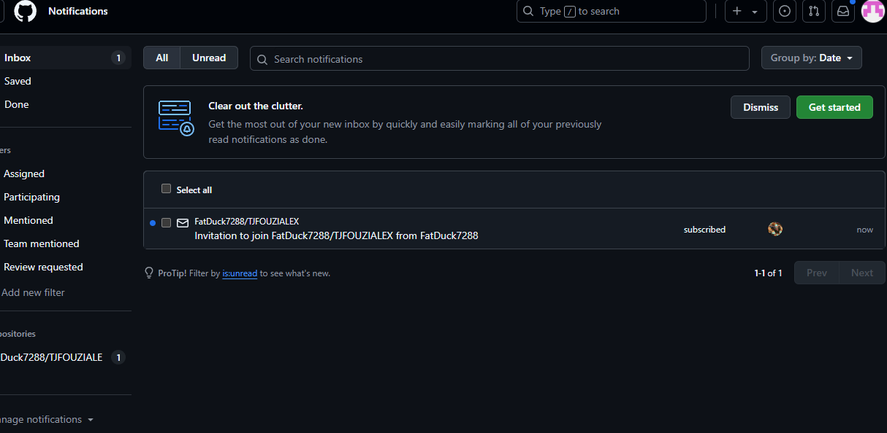
Accepter l'invitation
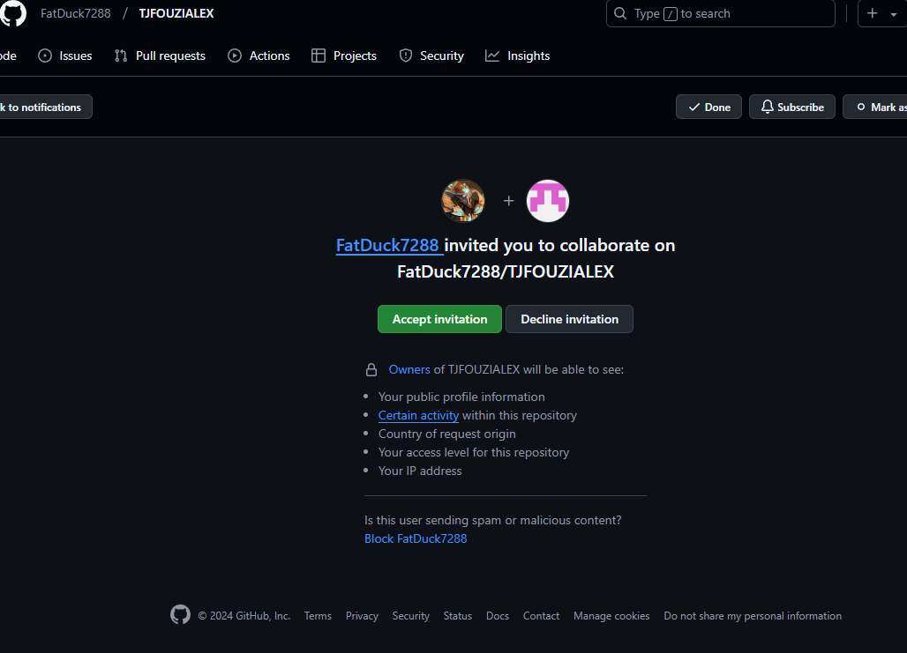
Cloner le repository
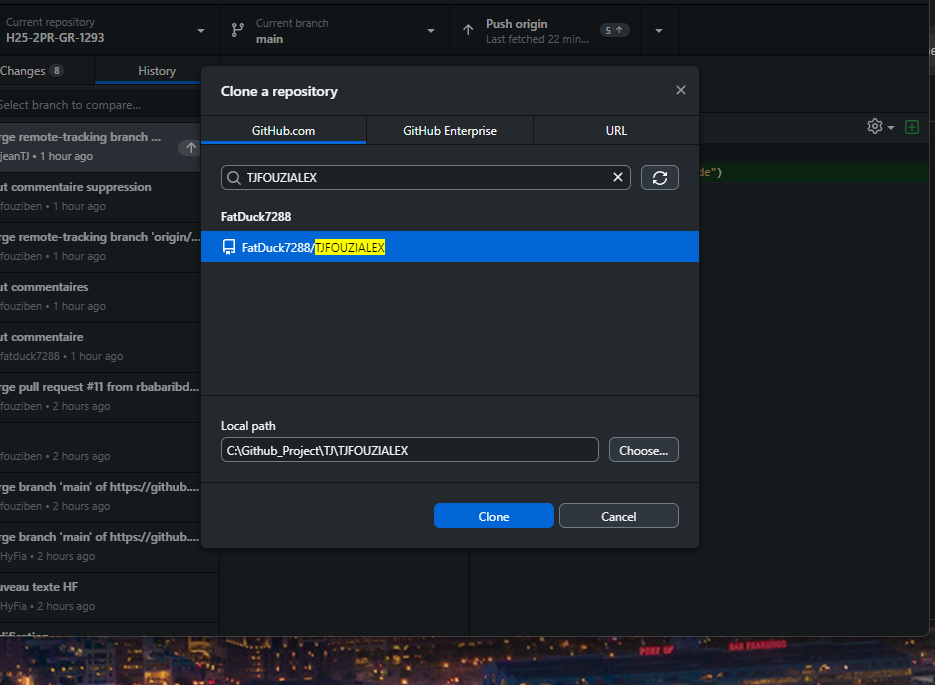
creation de branche
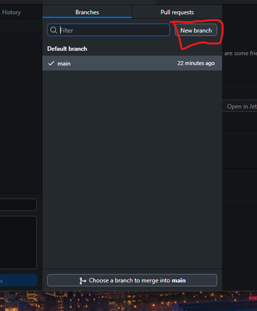
Publish Branch
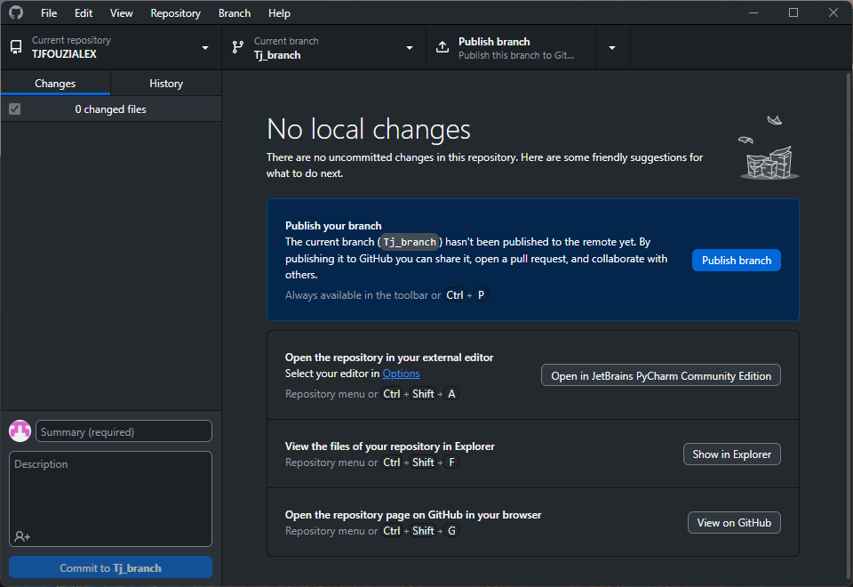
commit to TJ_branch

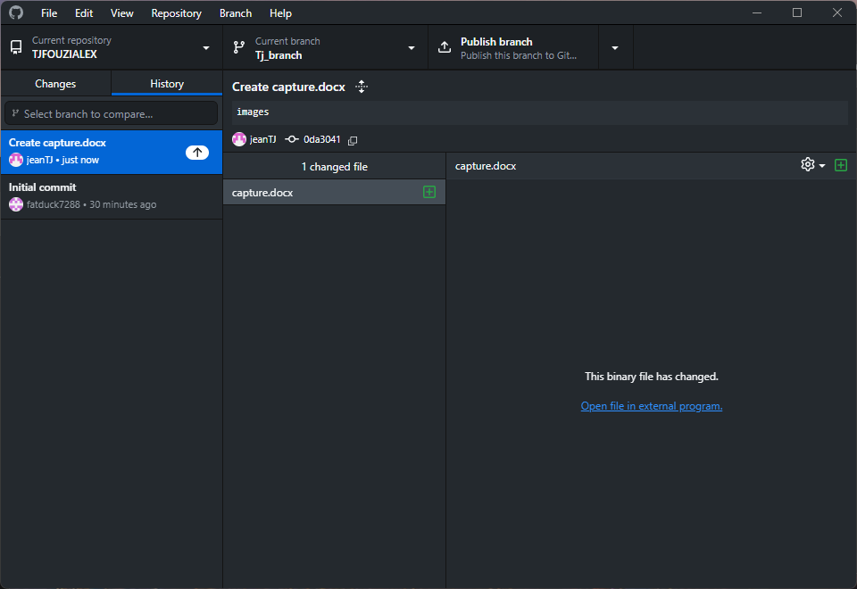

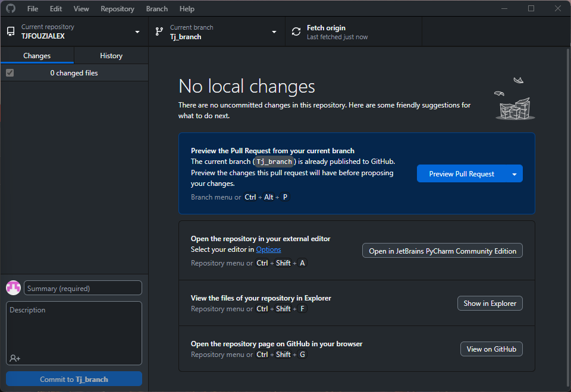
Compare and pull request
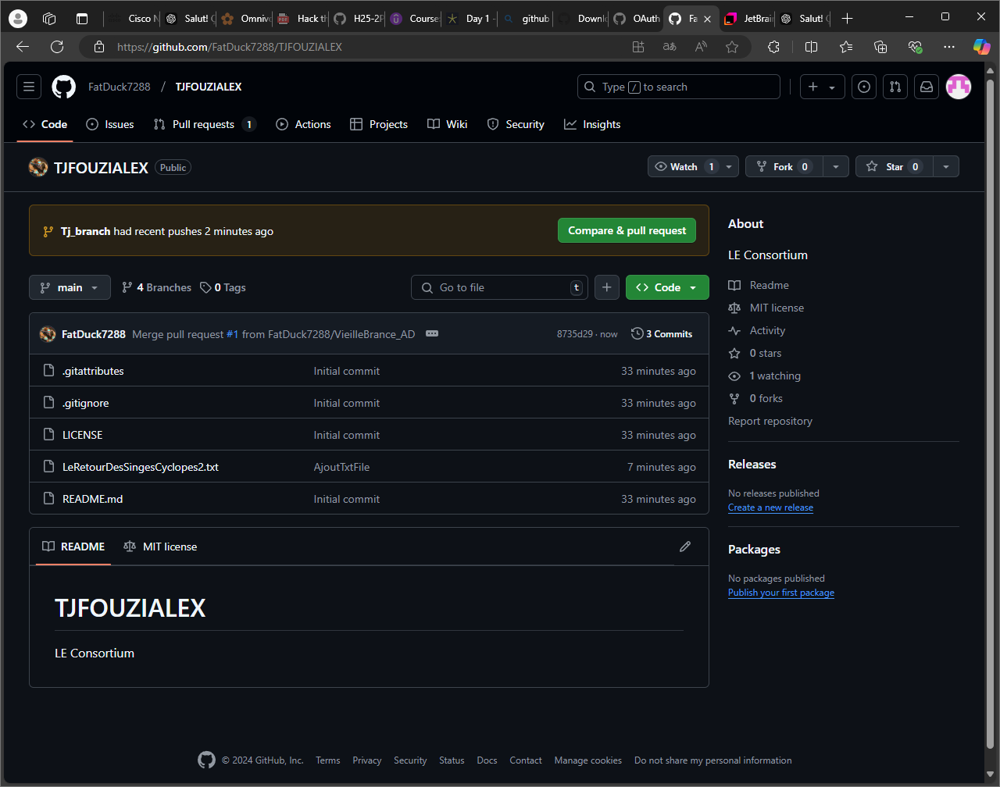
Faire le pull request
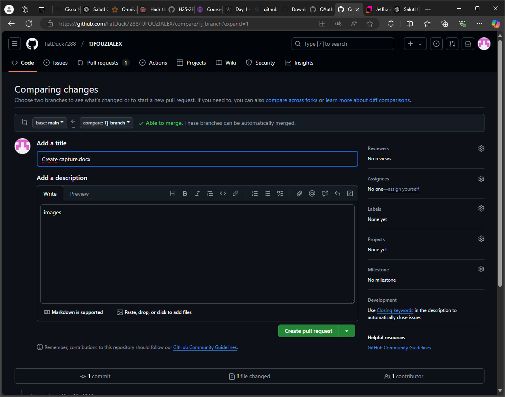
faire le merge
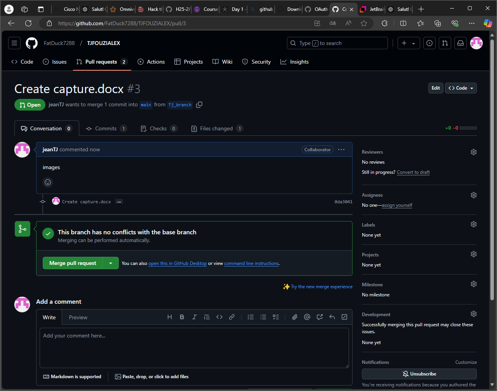
Merge reussi
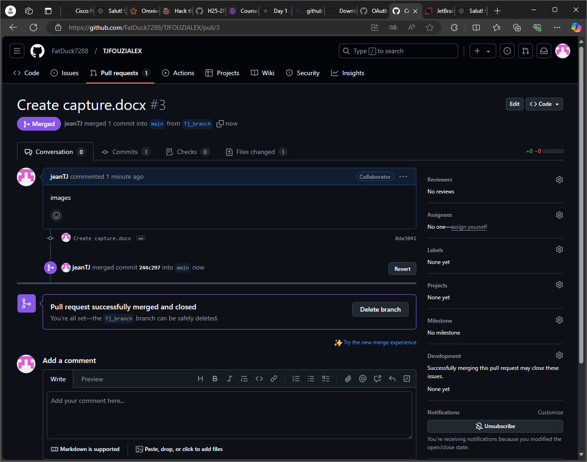
fusion des branches
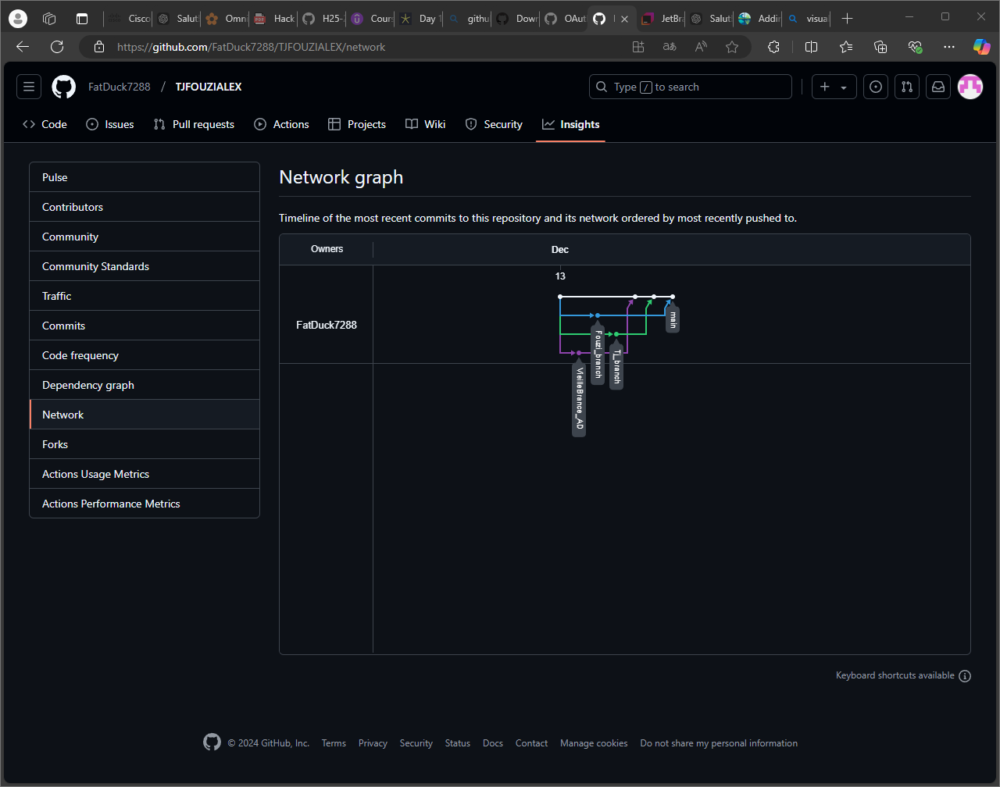