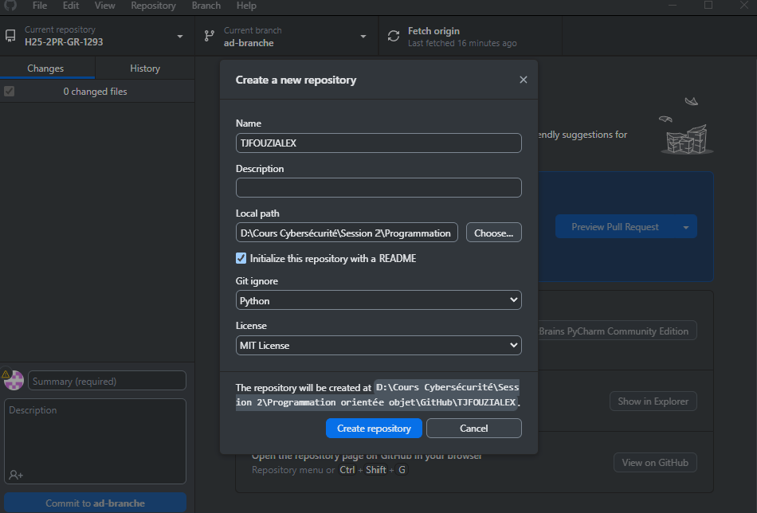

# TJFOUZIALEX
 LE Consortium

## Étape 1 : Création d'un repository
Voici une capture d'écran de la création du repository :

## Étape 2 : Publication sur GitHub
Voici une capture d'écran de la publication :

## Étape 3 : Ajout des collaborateurs
Capture d'écran de l'ajout des collaborateurs :

## Étape 4 : Création d'une branche
Capture d'écran de la création d'une branche :

## Étape 5 : Réalisation de commits depuis le projet local
Capture d'écran des commits :

## Étape 6 : Création d'une pull request
Capture d'écran de la pull request :

## Étape 7 : Fusion des branches
Capture d'écran de la fusion des branches :

